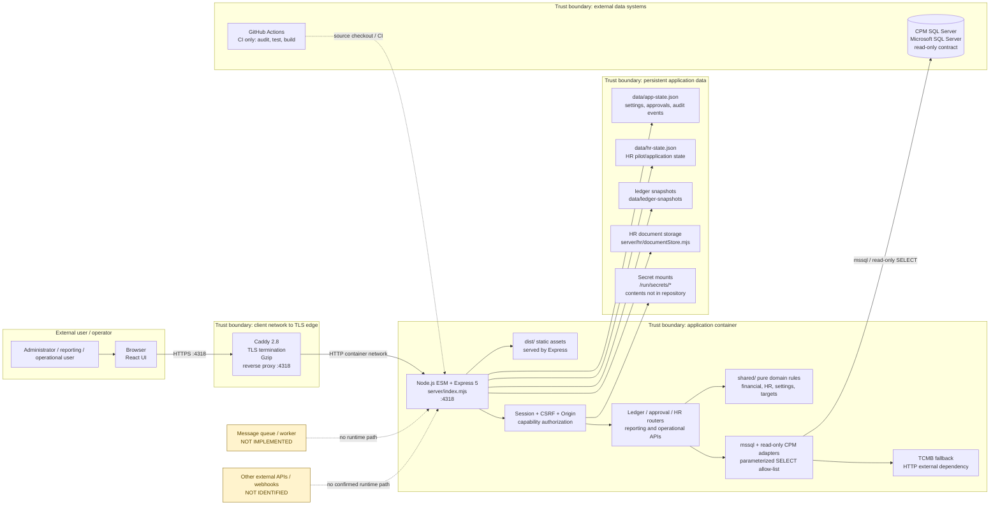

# Marlin Nexus — Current-State Architecture

> Verification date: 2026-09-09  
> Scope: repository source, Docker/Compose/Caddy configuration, and previously captured environment evidence.  
> Status: current-state documentation only; this is not a target-state design.

## 1. Evidence and confidence

This diagram is derived from `server/index.mjs`, `server/auth.mjs`, `server/cpm*`, `server/stateStore.mjs`, `server/hr/`, `src/`, `shared/`, `Dockerfile`, `compose.yaml`, `infra/Caddyfile`, and `docs/inventory.md`. A component marked **not implemented** or **unverified** must not be treated as available in production.

## 2. Current-state diagram

## 3. Component and boundary register

| Component | Current implementation | Boundary / data crossing | Evidence | Confidence |
|---|---|---|---|---|
| Browser frontend | React 19 + Vite 6; `src/`, `dist/` | User/browser boundary to HTTPS edge; API calls are same-origin/CSRF-aware | `src/main.jsx`, `src/api.js`, `vite.config.mjs` | Confirmed |
| TLS edge | Caddy 2.8; host-mounted certificate and key; reverse proxy to `marlin-profit-sharing:4318` | Internet/client network to container network | `compose.yaml`, `infra/Caddyfile` | Confirmed in config; live certificate trust chain separately pending |
| Application API | Node.js ESM + Express 5; `server/index.mjs` | Authenticated HTTP boundary; serves static UI and `/api/*` | `server/index.mjs`, `Dockerfile` | Confirmed |
| Authentication | HMAC session cookie, CSRF cookie/header match, Origin check, role capabilities | Identity/privilege boundary before protected API routes | `server/auth.mjs`, `server/authBoundary.mjs`, `server/capabilities.mjs` | Confirmed |
| Business routers | Ledger, approvals, HR, inventory/research, reconciliation and reporting routes | Capability-controlled API to domain/data adapters | `server/ledgerApi.mjs`, `server/approvalApi.mjs`, `server/hr/router.mjs` | Confirmed |
| Domain rules | Pure functions in `shared/` and server domain modules | In-process only; no direct framework/SDK boundary for shared rules | `shared/`, inventory/ledger modules | Confirmed |
| CPM adapter | `mssql`, read-only transactions, parameterized SELECT/query allow-list | Application container to external SQL Server | `server/cpmConnectionConfig.mjs`, `server/cpmReadOnly.mjs`, `server/cpmTransaction.mjs` | Confirmed by code; live schema/SLA not fully verified |
| CPM database | Microsoft SQL Server, configured by `CPM_SQL_*` variables | External data trust boundary; Nexus must not write | `.env.example`, `compose.yaml`, `AGENTS.md` | Config confirmed; production identity unverified |
| Application state | Atomic JSON file store for settings, approvals, audit events | Container to `/app/data` bind mount | `server/stateStore.mjs`, `APP_STATE_FILE` | Confirmed |
| HR state/documents | JSON HR state plus document storage | Container filesystem/bind mount; contains sensitive HR data | `server/hr/hrStore.mjs`, `server/hr/documentStore.mjs` | Confirmed; backup/retention owner unverified |
| Ledger snapshots | File-based snapshots under `/app/data/ledger-snapshots` | Container to persistent data mount | `compose.yaml`, `LEDGER_SNAPSHOT_DIR` | Confirmed; restore process unverified |
| Secret storage | Compose read-only mounts for CPM credentials and Nexus users; required environment secrets | Secret boundary into application/edge runtime | `compose.yaml`, `.env.example` | Config confirmed; approved secret manager unverified |
| TCMB fallback | HTTP fallback for historical exchange rates | Application container to public external service | `server/tcmbRateSource.mjs`, inventory | Code confirmed; endpoint/SLA/quota unverified |
| CI | GitHub Actions runs audit, tests, build; no deploy step | Source repository to CI runner | `.github/workflows/ci.yml` | Confirmed |
| Queue/worker | No Redis, RabbitMQ, Kafka, AMQP, Bull, or worker service in runtime config | No asynchronous queue boundary currently present | `package.json`, `compose.yaml`, server source scan | Confirmed absent in current checkout |
| Other external APIs/webhooks | No additional confirmed runtime integration | Not applicable | Source/inventory scan | Not identified |

## 4. Network and trust boundaries

1. **Client → Caddy edge:** Browser traffic crosses the external network boundary over HTTPS on host port `4318`. Caddy terminates TLS using host-mounted certificate/key files.
2. **Caddy → application container:** Caddy forwards HTTP to the Compose service name `marlin-profit-sharing:4318` on the internal container network. This hop is not independently TLS-protected.
3. **Application auth boundary:** `/api/session/login` is public; protected API routes require a valid signed session. Mutating methods additionally require CSRF cookie/header equality and matching configured Origin. Unknown capabilities fail closed.
4. **Application → CPM SQL Server:** The application crosses into the CPM data boundary through `mssql`. The intended contract is read-only, parameterized `SELECT` access; database credentials are supplied through secret configuration and are not part of this document.
5. **Application → file persistence:** Nexus and HR state, documents, and ledger snapshots are stored on the container's persistent `/app/data` mount. This is a high-trust local boundary containing mutable application state and potentially sensitive HR data.
6. **Application → TCMB:** Historical-rate fallback crosses an external HTTP dependency boundary. Availability, response semantics, quota, and change control are not owned by Nexus.
7. **CI boundary:** GitHub Actions consumes source and produces validation/build outputs. The workflow currently has no production deployment step.

## 5. Single points of failure (SPOF) and resilience gaps

| Rank | SPOF / failure mode | Impact | Current mitigation | Evidence / required follow-up |
|---|---|---|---|---|
| Critical | Single Caddy edge/container and host port `4318` | Public UI/API unavailable if edge host, container, certificate, or port fails | `restart: unless-stopped`; containerized edge | No redundant edge or failover documented; test certificate renewal and edge recovery |
| Critical | Single Nexus API container/process | All authenticated UI/API functionality unavailable | Docker restart policy; candidate validation tooling | No horizontal replica or load-balancer configuration; define recovery objective and startup/readiness monitoring |
| Critical | Single persistent `/app/data` bind mount | State, HR data, documents, and ledger snapshots can be lost/corrupted or become unavailable | Atomic JSON writes; host bind mount | Backup, restore, retention, and filesystem monitoring are not proven; perform restore drill |
| Critical | CPM SQL Server dependency | Live financial, sales, inventory, and reporting data unavailable or stale | Read-only connection, retries/cache for selected paths | No documented SQL failover/read replica/SLA; define degraded-mode behavior and owner |
| High | Authentication secret/user source | Login and all protected API access fail if secret/user configuration is missing or invalid | Compose required variables and secret mounts; fail closed | Secret-store availability/rotation process unverified; establish managed secret delivery |
| High | Host-mounted TLS certificate/key | HTTPS startup or trust can fail on missing, expired, or untrusted files | Caddy config and certificate metadata captured | Renewal owner/automation and CA distribution are unverified |
| High | TCMB fallback | Historical exchange-rate resolution may become review-required or incomplete | Fallback deadline/attempt caps and evidence statuses | Validate rate-source semantics, quota, and explicit outage behavior |
| Medium | In-process cache and one Node event loop | Cache loss increases CPM load; process saturation impacts all requests | Time-bounded caches and SQL retry code | No external cache, queue, or worker scaling path is implemented |
| Medium | CI provider/workflow | Validation feedback unavailable if GitHub Actions fails | Local commands can be run manually | No second CI provider or mirrored artifact path documented |

## 6. Explicitly absent or unverified capabilities

- **No message queue or background worker service** is present in the current Compose/runtime configuration. In-process arrays/queues used by algorithms are not durable message infrastructure.
- **No production deployment step** exists in the GitHub Actions workflow; release runner contracts are local validation/operation tooling, not proof of automated deployment.
- **No documented HA/failover topology** exists for Caddy, Nexus API, CPM SQL Server, or file storage.
- **No verified production owner** is assigned in the inventory for the edge, API, CPM, state files, certificate, secret store, TCMB integration, or CI.
- **No target-state recommendations** are implied by this document; resilience remediation belongs to a separate architecture decision and acceptance plan.

## 7. Review checklist

Before treating this architecture as production-approved, obtain evidence for:

- [ ] Technical owner and operational owner for every component in the register.
- [ ] Production DNS/firewall/load-balancer topology and an authenticated smoke test.
- [ ] CPM SQL Server identity, read-only permissions, backup/failover, and maintenance window.
- [ ] `/app/data` backup, restore, retention, encryption, and recovery objective.
- [ ] TLS CA trust distribution, renewal automation, and certificate expiry alerting.
- [ ] Secret-store selection, rotation procedure, access audit, and old-secret invalidation evidence.
- [ ] Monitoring/alerting for edge, API, CPM connectivity, disk capacity, state writes, and certificate expiry.
- [ ] Explicit business decision for TCMB outage and CPM outage behavior.

**Architecture status:** `CURRENT_STATE_DOCUMENTED`, `QUEUE_NOT_IMPLEMENTED`, `SPOF_REGISTERED`, `OWNER_SIGN_OFF_PENDING`.
